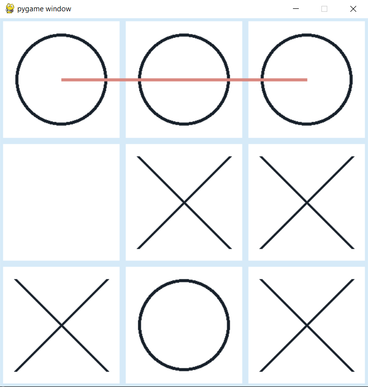
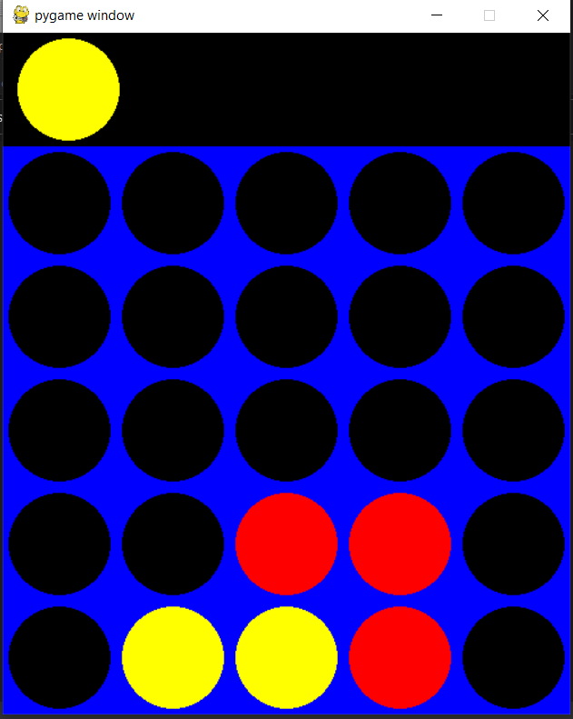

# Game-AI-Minimax-vs-Q-Learning
In this project, , I have implemented two classic games, Tic Tac Toe and Connect 4, and applied Minimax algorithm with alpha-beta pruning and tabular Q-learning reinforcement learning algorithm, to play against default opponents and each other. The objective of this project is to evaluate and compare compare their performance .
 
<!-- 
 -->
  
<!-- 
 -->
<!--   -->
<!-- 
 -->
  
<!-- 
 -->

Solarized dark        |  Connect4
:-------------------------:|:-------------------------:
  |  

# Implementation of Algorithms
This project implements two classic games, Tic Tac Toe and Connect 4, and applies two well-known AI techniques, Minimax algorithm with alpha-beta pruning and tabular Q-learning reinforcement learning algorithm, to play against default opponents and each other. The objective of this project is to evaluate and compare the performance of these two algorithms in these two games.

## Minimax with alpha-beta pruning
The Minimax algorithm is a decision-making algorithm that searches through all possible moves and outcomes of a game to determine the best possible move for the current player. Alpha-beta pruning is used to optimize the Minimax algorithm by cutting off the search when it identifies a branch that is unlikely to lead to the best outcome.

## Q-Learning
Tabular Q-learning is a type of reinforcement learning technique that learns and improves with training. It assigns a Q-value to each possible action in a given state, which is updated over time as the algorithm interacts with the environment and learns which actions result in the highest rewards. The algorithm balances between exploration and exploitation by randomly selecting an action to explore new possibilities, or choosing the action with the highest Q-value to exploit its current knowledge.

## Default Agent Algorithm
A default agent is implemented for both Tic Tac Toe and Connect 4. This agent blocks the opponent’s next move if it is winning. Otherwise, it plays the winning move if there is one. If any of these scenarios are not possible, then it plays a random move.

## Design Decisions
For Tic Tac Toe, the following hyperparameters were chosen for Q-Learning: ε=0.3, α=0.2, γ=0.9. The reward function encourages the algorithm to learn to win the game while avoiding losing.

For Connect4, the following hyperparameters were chosen for Q-Learning: ε=0.3, α=0.5, γ=0.9. A 5x5 board was implemented to reduce the training time. The reward function was set to 1 if the Q-Agent (the AI) wins, -1 if the opponent (Minimax) wins, and a small positive value (1/25) if the game ends in a draw.

The choice of hyperparameters was based on examples from literature and fine-tuning through trial and error to achieve optimal performance.

